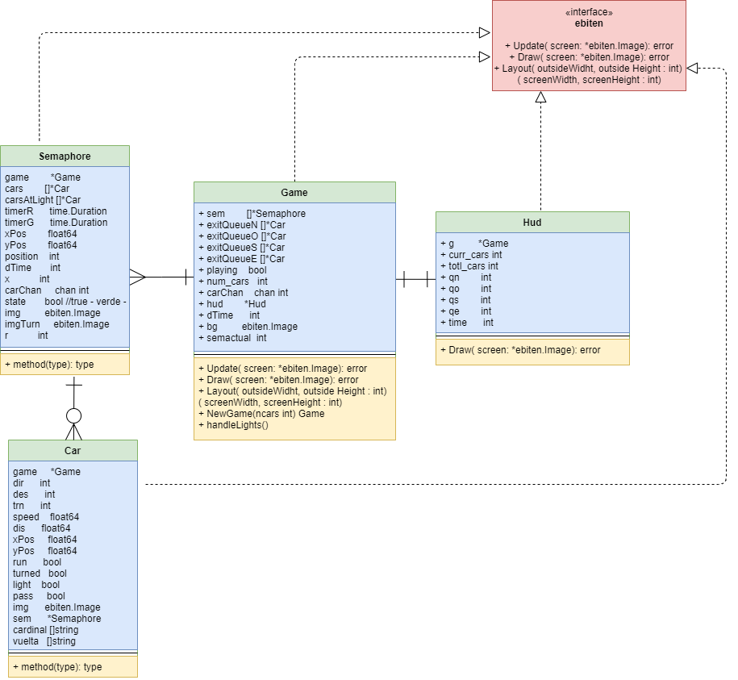

# City Traffic

Traffic simulator in go.

## Architecture
**Ebiten library**

According to their [documentation](https://github.com/hajimehoshi/ebiten/): Ebiten is an open source game library for the Go programming language. Ebiten is a package allows you to  develop 2D graphics in a more practical way.

**Ebiten Game Design**

Ebiten makes graphic representations in go a little easier, there are three necessary methods that require implementation:

* **Update**: This method is where you put the game logic, which will be updated each `Tick` (1/60th of a second).
* **Draw**: Method to render the images in every frame. 
* **Layout**: Method that defines the overall game layout.

### Project Structure
The structure is made of two folders and the main.go file: 

* city-traffic 
    * imgs/ - images used for the graphic interfaces
    * scripts/ - scripts used for the simulator
    * main.go

The `scripts/` is where the game logic resides. The main entities needed for the game are:
* Game [game.go](https://github.com/AndreCalderonB/ProyectoFinalPA/blob/master/city-traffic/scripts/game.go)
* Semaphore [semaphore.go](https://github.com/AndreCalderonB/ProyectoFinalPA/blob/master/city-traffic/scripts/semaphore.go)
* Car [car.go](https://github.com/AndreCalderonB/ProyectoFinalPA/blob/master/city-traffic/scripts/car.go)
* A Hud [hud.go](https://github.com/AndreCalderonB/ProyectoFinalPA/blob/master/city-traffic/scripts/hud.go)

`game.go` will have all `ebiten.Game` interface methods implemented, in addition to the following functions and methods 
* **NewGame**: function that instanciates a new game and receives the maximum number of cars it will spawn. The maximum is 4 cars because after that quantity it can begin to fail to work properly.
* **handleLights**: this is the actual function that handles the turning `on` and `off`

As we know, we need to implement the `Game` interface. This is done in `main.go` for simplicity reasons, but inside `game.go` we will code the functionality of the structure.

`semaphore.go` is the entity that controls traffic in each lane of cars. A semaphore can do the following:
* **makeCar**. This function initializes cars at its lane and then spawns cars after the others are gone.
* **toggleLight**. A semaphore should be able to toggle the color of its own light. Each semaphore has a timer to change color asynchronously with the ohter semaphores
* **queueManager**. Runs concurrently, it helps us control the amount of cars on each lane
* **queue**. After a car is initialized on the lane it is added to a queue of waiting cars at the semaphore.
* **dequeue**. When a car position that belongs at the lane has passed the semaphore, the car is dequeued form the waiting line.

`car.go` is the entity that controls each car, and its "decisions" depending on the other members of the queue:
* **carInit**. Initiates the car struct and starts running concurrent scripts.
* **checkSemaphore**.. Script that concurrently checks the status of the semaphore it belongs to.
* **matchSpeed** .Script that concurrently compares the speed of the car in front of the car to its own.
* **queuePos**. Returns the position in the queue of the car
* **exitQueuePos**. Returns the position in the exiting queue of the car
* **atPos**. Calculates the distance from each car to the point of stop at each semaphore wait.
* **carStop**. Stops the car at their respective position of waiting before the semaphore.
* **carStart**. Allows the car to keep movement.
* **dequeueW**. Removes the car from the waiting queue.
* **queueW**. Adds the car to the waiting queue.
* **queue**. Adds the car to the exit queue
* **dequeue**. Removes the car from the exit queue

`hud.go` this entity renders text information at the screen:
* **Draw**. This function only shows the information from the game and draws a text into the screen

### Concurrency

Each Semaphore has a queueManager, which runs concurrently, it spawns cars, and helps us control the amount of cars on each lane, so they don´t go on top of each other.

Each Car checks the light of the lane it´s on, and the speed of the car directly in front of it.

# Link to video

[documentation](youtube.com)